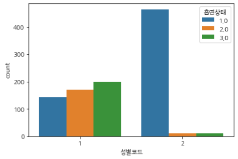

# MATPLOT

## 	그래프를 그리는 기준

통계 분석도 동일한 기준을 갖는다.

import numpy as np

import pandas as pd

import matplotlib.pyplot as plt

import seaborn as sns

from matplotlib import font_manager, rcParams

!apt-get install fonts-nanum*

rcParams['font.family'] = 'NanumGothic'

rcParams['axes.unicode_minus'] = False

font_manager._rebuild()

### 자료의 형태 (변수의 종류)

- 범주형 vs 연속형

- 질적변수 vs 양적변수

  - 질적변수(Qualitative Variable) : 변수의 값이 비 수치적 및 특정 카테고리에 포함되는 경우

    - 명목형 : 특정 범주에 포함되지만, 순위를 갖지 않는 경우 (성별, 혈액형, ...)

    - 순위형 : 특정 범주에 포함되지만, 순위를 갖는 경우 (성적, 등급,...)

  - 양적변수(Quantitative Variable) : 변수의 값이 수치적이고, 연속적인 경우(키, 나이, ...)

    - 이산형 : 셀 수 있는 경우(정수인 경우)
    - 연속형 : 셀 수 없는 경우(실수인 경우)

### 자료의 차원

- 변수의 개수는 차원이 된다. (많을 수록 높아진다.)
- 차원이 높으면, 시각화할 수 없다.
  - 최대 2차원 화면에서 3차원으로 나타낼 수 있다.
- 1차원
  - 일변수(일변량) : 변수 하나에 대한 시각화
  - 변수의 분포 등을 확인
- 2차원
  - 이변수(이변량) : 변수와 변수의 관계를 확인하고 싶은 경우
    - 연속형 and 연속형 변수
    - 연속형 and 이산형 변수
    - 이산형 and 이산형 변수

### 1차원 시각화

- 변수 1개인 경우
  - 범주형인 경우 : countplot(빈도 확인)
  - 연속형인 경우 : histplot, displot

rawData.describe(include = 'all').T  하면 Transpose

### 범주형

- 샘플 자료에서는 비수치적인 자료는 없다.
  - 수치적인 자료들(이산형) 중에서 범주형에 해당하는 변수를 확인
  - 흡연상태, 구강검진 수검여부, 치석, 성별코드

- rawData['흡연상태'].unique() : array([3., 1., 2.])
- rawData['구강검진 수검여부'].unique() : array([1, 0])
- sns.countplot(data=rawData, x= '흡연상태')
- sns.countplot(data=rawData, x = '성별코드')
- sns.countplot(data = rawData, x= '연령대코드(5세단위)')
- sns.countplot(data=rawData, x ='시도코드')

### 연속형

#### hisplot

- sns.histplot(data=rawData, '총콜레스테롤')

- sns.countplot(data=rawData, x='총콜레스테롤')

- histplot은 x축이 범위로 지정되었고, coutplot은 x값 하나하나 표시했다.

#### hisplot 조정

- 트리글리세라이드 아웃라인 조정
- sns.histplot(data=rawData, x='트리글리세라이드')

rawData[rawData['트리글리세라이드'] > 1750]

tmp = rawData.drop(index = 942)

sns.histplot(data=tmp,x='트리글리세라이드') : 위 세 줄을 통해 x축에서 너무 높은 값을 제거

plt.hist(rawData['트리글리세라이드'], bins=50)

plt.xlim(21,500)

plt.show

#### displot

sns.displot(data = rawData, x='총콜레스테롤',kde=True), 밀도를 보여준다.

### 2차원의 시각화

- 두 자료간의 관계를 확인하고 싶은 경우
  - 타켓변수와 입력변수들과의 관계 (인과성)
  - 입력변수와 입력변수들과의 관계 (상관성)
    - 입력변수들은 서로 독립적임을 가정
- 두 변수 모두 연속형
  - scatterplot, lineplot, jointplot, rugplot, ...
- 연속형 변수와 범주형 변수
  - barplot, boxplot
- 두 변수 모두 범주형
  - coutplot

#### 두 변수 모두 연속형

##### 산포형

- sns.scatterplot(data=rawData, x='총콜레스테롤', y='트리글리세라이드')

- 아웃라이어를 제거한 tmp로도 그려보았다.

##### 회귀선(추세선 인가?)

- sns.lmplot(data=tmp, x='총콜레스테롤', y='트리글리세라이드')

##### regplot

- sns.regplot(data=tmp, x='총콜레스테롤', y='트리글리세라이드',line_kws={'color':'red'})

##### jlintplot

1. LDL콜레 - 총콜레
   - sns.jointplot(data=tmp, x='LDL콜레스테롤',y='총콜레스테롤')

2. LDL - 총 간의 상관계수

   - tmp[ ['LDL콜레스테롤', '총콜레스테롤']].corr() : 둘 간의 상관관계가 꽤나 높다.

     

##### rugplot

- 자료의 위치정도를 확인 가능함. 밀도정도도 물론 가능
- 자료가 아주 많은 경우 히스토그램을 확인할 수 없는 경우가 존재.
- 위의 경우 rugplot을 이용하여 확인!
- sns.rugplot(data=rawData, x='총콜레스테롤', height=1)

##### 파생변수

- IDL 콜레스테롤 수치를 구해보자.
- 주어진 자료에서 타켓변수를 잘 설명할 수 있는 새로운 변수를 만들어 내는 것.
  - 데이터 마이닝
- IDL = 총 - (HDL + LDL)

#### 연속형 / 범주형 변수

##### barplot(비율)

- 흡연과 콜레스테롤의 관계를 확인해보자.

sns.barplot(data=tmp, x= '흡연상태', y='IDL콜레스테롤')

sns.countplot(data=tmp, x='흡연상태')

===> 단순히 countplot으로 확인했을 때, 1.0인 비흡연자의 비율이 상당히 높은 것을 확인할 수 있다.

​		반면, barplot을 살펴볼 때, 절대적인 수가 높은 1.0의 IDL콜레스테롤 수치가 2.0과 3.0에 비교하면

​		상당히 낮은 것을 볼 수 있다.

##### 두 변수 모두 범주형 : countplot

sns.countplot(data=tmp, x='성별코드', hue='흡연상태') : hue parameter 사용하여 두 집군을 표현(이선 or 범주)

##### boxplot

- 탐색적 자료 분석(EDA)에서 많이 사용
- 4분위수를 이용한 시각화
  - 이상치(outlier)를 확인하는 용도로 사용
  - 자료를 4개의 구간으로 나눈 값 (1분위수 - 25%, 2분위수 - 50%, 3분위수 - 75% 해당)
  - IQR(inter Quatile Range)
    - IQR = Q3 - Q1
    - 최대 제한선 = Q3 + (IQR*1.5)
    - 최소 제한선 = Q1 - (IQR*1.5)

sns.boxplot(data=tmp, x='흡연상태',y='IDL콜레스테롤')

#### 변수가 3개 이상인 경우

- 최대 4개까지 표현 가능
  - 물론 변수의 종류에 따라 달라진다.

##### barplot

sns.barplot(data=tmp,x='흡연상태',y='IDL콜레스테롤',hue='성별코드') : 결과로 보여지는 y축엔 연속형이 낫다(count제외)

##### jointplot

sns.jointplot(data=tmp,x='IDL콜레스테롤',y='트리글리세라이드',hue='성별코드')

##### scatterplot

plt.figure(figsize=(12,6))

sns.scatterplot(data=tmp,x='IDL콜레스테롤',y='트리글리세라이드',hue='흡연상태',size='총콜레스테롤',sizes=(30,500))

## 그래프 표현

### subplot

plt.figure( figsize=(12,5))

plt.subplot( 2, 2, 1) : 2행 2열 중 1번째

### subplots

fig, ax =plt.subplots(2,2,figsize=(15,5))

sns.countplot(data=rawData, x='흡연상태',ax=ax[0,0])

sns.barplot(data=tmp, x= '흡연상태', y='IDL콜레스테롤',ax=ax[0,1])

sns.boxplot(data=tmp, x='흡연상태',y='IDL콜레스테롤',ax=ax[1,0])

## 색 지정

sns.palplot(sns.color_palette('hls', 20))

sns.palplot( sns.color_palette('coolwarm', 20) )

sns.palplot( sns.color_palette('rocket', 20) )

colors = sns.color_palette('hls')

sns.countplot(~~~~~~~, palette=colors)

