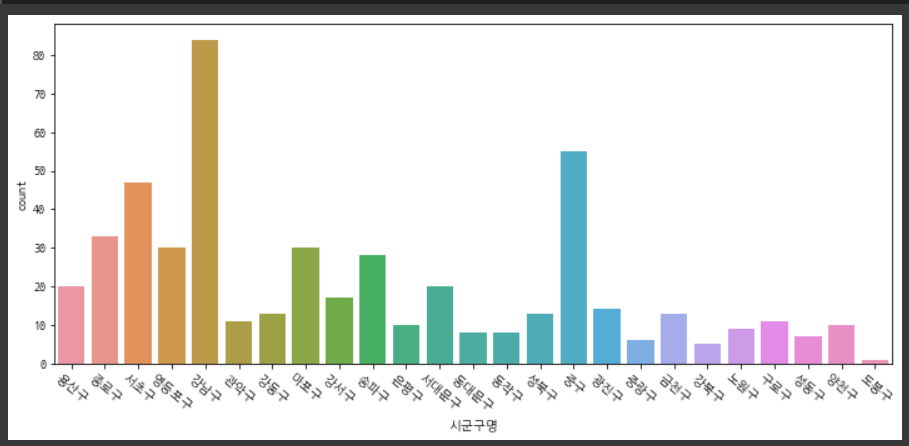
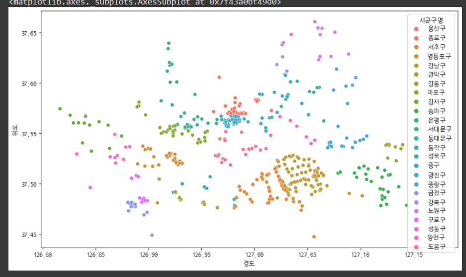
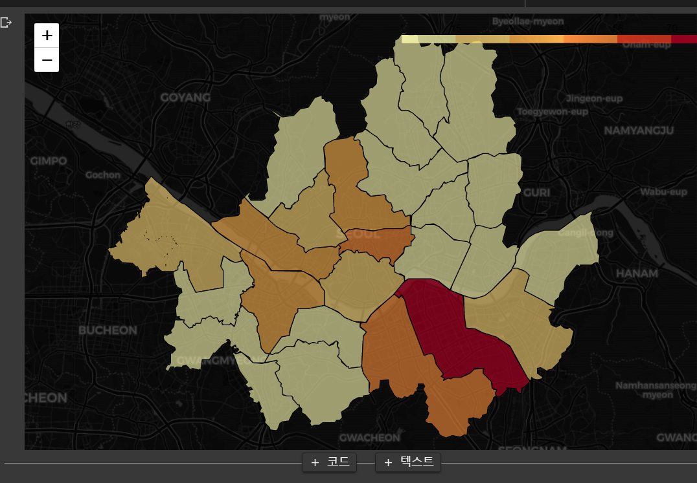

# covid-19 실습


## int64날짜를 date형태로 변환

```
death['날짜'] = pd.to_datetime(confirm['날짜'], format='%Y%m%d')
```


## y_label 좌/우 설정

```
plt.figure(figsize = (12,5))
sns.lineplot( data=confirm, x='날짜', y='서울')

ax = plt.gca()
ax2 = ax.twinx()

sns.lineplot( data = death, x='날짜', y='서울',color='red')
```


## 인덱스 맞추기

```
tmp2 = tmp2[tmp1.index]

tmp2
```


## 한글화 및 그래프

```
from matplotlib import font_manager, rcParams
!apt-get install fonts-nanum*
rcParams['font.family'] = 'NanumGothicCoding'
rcParams['axes.unicode_minus'] = False
font_manager._rebuild()

!pip install --upgrade plotly
import plotly.express as px

import json
import folium

import warnings
warnings.filterwarnings('always')
warnings.filterwarnings('ignore')

import numpy as np
import pandas as pd

import matplotlib.pyplot as plt
import seaborn as sns
```


## 데이터 정렬 diff drop fillna

```
tmp = death.drop(columns='날짜').diff().fillna(0)
tmp2 = pd.concat( [death['날짜'], tmp], axis=1 )
tmp2
```


## count 활용

```
rawData['시도명'].value_counts()
```


## 스타벅스가 포함된 매장 이름들

```
coffee[coffee['상호명'].str.contains('스타벅스')]['상호명'].unique()
```


## 위도 경도 평균값

```
lat = star['위도'].mean()
lng = star['경도'].mean()
```


## countplot

```
plt.figure(figsize = (12,5))
sns.countplot( data = star, x= '시군구명')
plt.xticks( rotation=320)
plt.show()
```



## scatterplot

```
plt.figure( figsize = (12,7))
sns.scatterplot( data=star, x='경도', y='위도', hue='시군구명')
```




## folium에 마커 찍기

표현해야할 자료가 많으면 기본 마커로 전부 찍기 힘듬

```
map = folium.Map( location = [lat, lng], zoom_start=11, tiles='CartoDB dark_matter')

for i in star.index:
  folium.Marker([ star.loc[i,'위도'], star.loc[i,'경도'] ]).add_to(map)

map
```


## 피벗 테이블

```
pd.pivot_table(star, index = '시군구명', values='상호명',aggfunc = 'count')
```


## 지도 위에 그리기

```
geojson = json.load(open ('/content/drive/MyDrive/data/seoulsigungu.geojson'))
geojson['features'][0]['properties']
		
		이케나옴
		{'ESRI_PK': 0,
		 'SHAPE_AREA': 0.00210990544544,
 		'SHAPE_LEN': 0.239901251347,
		 'SIG_CD': '11320',
 		'SIG_ENG_NM': 'Dobong-gu',
 		'SIG_KOR_NM': '도봉구'}
```


```
map = folium.Map( location = [ lat, lng ], zoom_start=11, tiles="CartoDB dark_matter" )

folium.Choropleth(
  geo_data = geojson,
  data = star_by_gu,
  columns = [star_by_gu.index, '매장수'],
  fill_color='YlOrRd',
  # fill_opacity = 0.7,
  # line_opacity=0.5,
  key_on = 'properties.SIG_KOR_NM'
).add_to(map)

map
```




