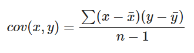
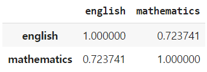
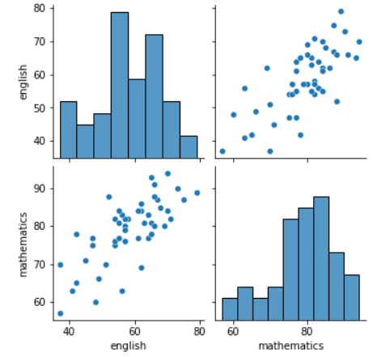

# 통계와 확률 분포

```
import warnings
warnings.filterwarnings('always')
warnings.filterwarnings('ignore')

import numpy as np
import pandas as pd

import matplotlib.pyplot as plt
import seaborn as sns
```

## 기술 통계

- 기초 통계를 이용해서 자료의 성질과 특성을 확인(설명)하는 것이다.
- 자료의 요약된 정보
  - 자료의 자세한 정보는 확인 불가하다.
    - 수 백만 가지의 데이터를 다루는 빅 데이터 시대엔 자세한 정보까지 볼 수 없다.
    - 따라서 통계로 접근해야 한다.
    - 자료의 아주 자세한 정보는 관심 밖이다.
  - 통계로 대용량의 자료에 접근하는 방법을 배워보자!
- 통계적 수치(통계량)
  - 중심에 대한 통계
  - 산포에 대한 통계
  - 관계에 대한 통계
  - 현태에 대한 통계


## 중심에 대한 통계

- 자료의 중심에 대한 경향을 나타내는 수치
- 평균 : 모 / 표본 / 샘플 평균
- 중앙값 : 자료의 50%에 해당하는 값
- 최빈값 : 가장 많이 등장하는 값


### numpy

- ```
  - scores = np.array( df['english'][:10])
  - np.mean( scores ) : 리스트의 평균
  - np.median( scores ) : 라수트의 중앙값
  ```


### pandas

- ```
  - df['english'][0:10].mean() : 영어 열 10번째 까지의 평균값
  - df['english'][0:10].median() : 영어 열 10번째 까지의 중앙값
  - df['english'][0:10].mode() : 영어 열 10번째 까지의 최빈값
  ```


## 산포에 대한 통계


### 편차  구하기

- ```
  - mean = np.mean(scores)
  - deviation = mean - scores
  ```

  각 값이 평균과 얼마나 떨어져 있나??


### 변동 구하기

​	편차가 큰 녀석들에게 패널티를 주기 위함!

- ```
  variation = np.sum( deviation**2 )
  ```

  


### 분산 구하기

- ```
  - variation / (len(scores) - 1)
  - np.var(scores)
  - df['english'][:10].var()
  ```

  

### 표준 편차 구하기

- ```
  np.std(scores)
  df['english'][:10].std()
  
  판다스로 한 번에 계산하기
  df['english'][:10].describe()
  
  count    10.000000
  mean     55.000000
  std       9.775252
  min      41.000000
  25%      48.250000
  50%      56.500000
  75%      63.250000
  max      69.000000
  ```


### 표준화와 편차

- 데이터에서 평균을 빼고 표준편차로 나누는 작업
  - 자료들이 서로 다른 분포를 가지고 있다면, 비교 작업이 어렵기 때문이다.
  - 자료들이 정규 분포임을 가정 즉, 정규분포가 아니라면 최선이 아닐 수도 있다.
  - 평균이나 분산에 상관 없이 표준화된 지표를 얻는다.
- 최소/최대, Robust, ...

```
z = (scores - mean) / np.std(scores) : 편차값
	array([-1.40182605,  1.50965882,  0.10783277, -1.50965882,  0.21566555,
    	   -0.75482941,  1.07832773, -0.64699664,  1.07832773,  0.32349832])
np.mean(z), np.std(z) : 평균은 0, 표준 편차는 1에 수렴한다.
	(-1.6653345369377347e-17, 0.9999999999999999)
```

- 편차값
  - 평균이 50, 표준편차가 10이 되도록 정규화
  - 편차값이 50이면 평균적인 결과
  - 50보다 클 수록 상위 결과라는 의미로 해석

```
z = 50 + 10*(scores - mean) / np.std(scores)
	array([35.98173948, 65.09658825, 51.07832773, 34.90341175, 52.15665546,
       42.45170588, 60.78327732, 43.53003361, 60.78327732, 53.2349832 ])
```


## 관계에 대한 통계

- 자료와 자료간의 관계를 나타내는 수치
  - 수치일 뿐, 해석하는 것은 분석가의 몫

1. 상관관계
   - 공분산 (Co-variance)
   - 두 변수 사이의 분산
     - 결과적으로 두 변수의 분산이 같이 커지거나, 작아지면 상관성이 있다고 해석
     - 또는 분산이 커지는대, 반대로 작아지거나 그 반대의 경우 상관성이 있다고 해석



- 공분산의 해석은 다음과 같다.

  - cov > 0 : x가 큰(작은) 값을 가질때, y도 큰(작은) 값을 가지는 경우

    - x의 분산이 커질 떄, y의 분산 또한 커지는 경우
    - x의 분산이 작아질 때, y의 분산이 같이 작아지는 경우

    

  - cov = 0인 경우, 0에 가까운 경우

    - x의 분산과 상관없이 y가 존재하는 경우
      - 음수와 양수가 섞이기 때문에, 0에 가까운 값을 가지게 됩니다.
      - 두 변수는 상관성이 적다로 해석

    

  - 단점

    - 두 변수 사이의 상관성이 낮아도 수치가 크면, 공분산 값이 크게 나올 수 있다.
    - 반대소 두 변수 사이의 상관성이 높아도 수치나 낮으면, 공분산 값은 작게 나올 가능성이 있다.
    - 상관계수: 공분산의 값을 -1과 1사이의 값으로 표준화 한 값
      - -1과 1에 가까울 수록 상관성이 높다고 해석
      - 0에 가까울 수록 상관성이 낮다로 해석


2. 인과관계

- 추론통계에서 확인하고자 하는 것이 인과성이 될 수 있습니다.
- 어떤 자료가 다른 자료의 원인이 되는 경우
  - 모든 변수가 무조건 원인이 될 수 있는 것은 아닙니다.

```
#영어 점수와 수학 점수의 공분산
en_scores = np.array( df['english'][:10])
ma_scores = np.array( df['mathematics'][:10])

cov = np.cov(en_scores, ma_scores, ddof=0)
	array([[86.  , 62.8 ],
       [62.8 , 68.44]])
       
np.corrcoef( en_scores, ma_scores )
	array([[1.        , 0.81856923],
       [0.81856923, 1.        ]])
```


- df[['english', 'mathematics']].corr()




- 두 변수의 상관성을 확인하기 좋은 시각화 `pair_plot`을 이용해볼 수 있습니다.
  - sns.pairplot( df[['english', 'mathematics']] )




- 꼬리를 기준으로 왜도를 설명한다.
  - 오른쪽으로 꼬리가 긴 경우 vs 왼쪽
- 우리가 원하는 모델은 양의 첨도


## 복원 추출 vs 비복원 추출

- np.random.choice(scores, 20) : 복원 추출
- np.random.choice(scores, 20, replace = False) : 비복원 추출

```
for i in range(5):
  sample = np.random.choice(scores, 20)
  print('{}번째 무작위 추출 후 얻은 표본평균: {}'.format(i+1, sample.mean()))

1번째 무작위 추출 후 얻은 표본평균: 65.1
2번째 무작위 추출 후 얻은 표본평균: 70.95
3번째 무작위 추출 후 얻은 표본평균: 71.05
4번째 무작위 추출 후 얻은 표본평균: 69.3
5번째 무작위 추출 후 얻은 표본평균: 67.25
```


