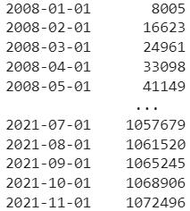
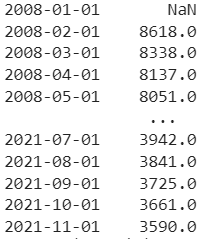
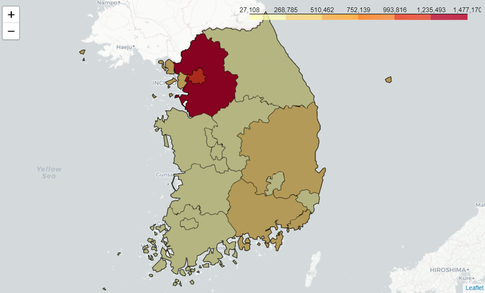
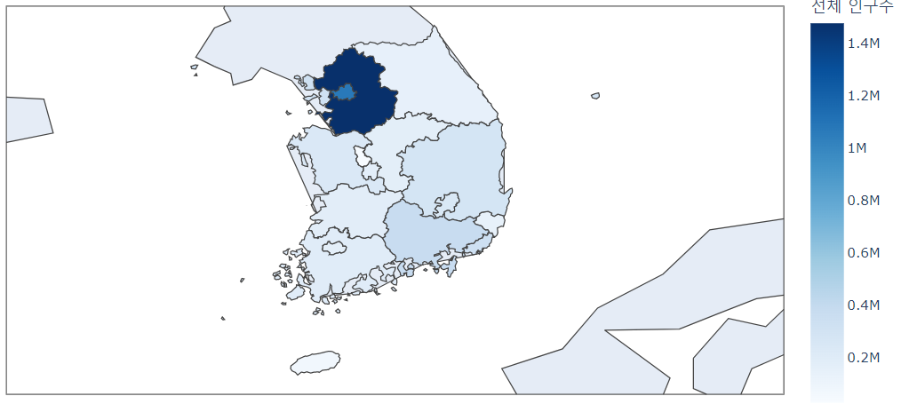

# 공공데이터 분석

## warning 제거

import warnings

warnings.filterwarnings('always')

warnings.filterwarnings('ignore')

## 함수의 정의

def conv(x):

 x.fillna('0', inplace=True)

 if x.name == '행정구역': return x

 return x.str.replace(',', '').astype(np.int)

def preProcessing( df ):

 tmp = df.iloc[:, 0::3]

 tmp['행정구역'] = tmp['행정구역'].str.split(' ').str[0]

 names = []

 for name in tmp.columns:

  if name == '행정구역':

   names.append(name)

   continue

  names.append(pd.to_datetime(name.split('_')[0], format='%Y년%m월'))

 tmp.columns = names

 tmp = tmp.apply( conv )

 tmp = tmp.set_index('행정구역')

 return tmp.T

## concat 사용하여 col 합치기

- merge와 조금 다르다.
- pd.concat( [tmp1, tmp2], axis=0 ) : default parmeter : axis = 0

## 지도 시각화

### cumsum()

- rawData['서울특별시'].cumsum()

### cumsum().diff()

- rawData['서울특별시'].cumsum().diff()

### 시각화 라이브러리

- plotly : 지도를 이용한 시각화에 장점

(https://plotly.com/python/maps/)

- pydeck : 지도에 예쁜 그림 가능 :), 인구유동 및 애니메이션 처리 가능, 콜랩에서 사용 불가 :(

(https://deckgl.readthedocs.io/en/latest/)

- folium

(https://python-visualization.github.io/folium/)

### 시각화를 위한 데이터

- 지도에 시/도 별 인구수를 표현해보자.
- 행정 구역별 경계 지도가 필요하다.
- 표현하고 싶은 시/도 별 좌표(위도/경도)가 필요하다.

### 시/도 별 위도와 경도

### 시/도 별 경계 구역

- shp vs geojson

### folium

- folium은 layered 로 표현할 수 있음

import folium

map = folium.Map( location =  [37, 127] , zoom_start = n ) : map을 n의 크기로 불러옴.

- 마커를 이용하여 인구수 표현

### plotly

- layered가 안된다.

